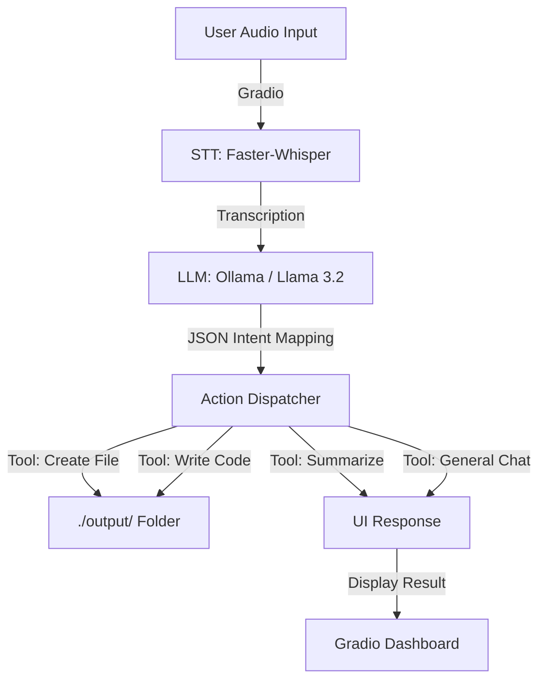

# 🎙️ VoixAI: Local Voice-Controlled AI Agent

VoixAI is a high-performance, 100% local AI assistant that takes audio commands (via microphone or file upload), transcribes them, classifies intent using a local LLM, and executes file/text actions within a secured environment.

## ✨ Features
- **Speech-to-Text (STT):** Powered by `faster-whisper` for lightning-fast local transcription.
- **Intent Understanding:** Driven by `Ollama` and `Llama 3.2`.
- **Compound Commands:** Can handle multiple tasks in one go (e.g., "Create a file and write some code").
- **Human-in-the-Loop:** A clean Gradio UI that asks for confirmation before any file operations.
- **Safety First:** All file operations are restricted to the `./output/` directory.
- **Privacy:** Processed entirely on your machine; no data leaves the system.

---

## 🛠️ Prerequisites

Before running the application, ensure you have the following installed:

### 1. FFmpeg (Critical)
`faster-whisper` requires FFmpeg for audio processing.

- **Windows (Chocolatey):** `choco install ffmpeg`
- **Windows (Direct):** Download from [ffmpeg.org](https://ffmpeg.org/download.html) and add the `bin` folder to your PATH.
- **macOS (Homebrew):** `brew install ffmpeg`
- **Linux:** `sudo apt update && sudo apt install ffmpeg`

### 2. Ollama
Install Ollama from [ollama.com](https://ollama.com). Once installed, pull the Llama 3.2 model:
```bash
ollama pull llama3.2
```

---

## 🚀 Setup & Installation

1. **Clone the repository:**
   ```bash
   git clone <repo-url>
   cd VoixAI
   ```

2. **Create a virtual environment (optional but recommended):**
   ```bash
   python -m venv venv
   source venv/bin/activate  # On Windows: venv\Scripts\activate
   ```

3. **Install dependencies:**
   ```bash
   pip install -r requirements.txt
   ```

4. **Run the app:**
   ```bash
   python app.py
   ```

---

## 📂 Architecture



### Why these models?
- **Faster-Whisper:** Chosen for its significant speed improvements over the original Whisper implementation. It uses CTranslate2 for efficient inference on CPU.
- **Llama 3.2:** A lightweight, high-performance LLM that excels at understanding instructions and generating structured JSON outputs for tool orchestration.

---

## 🛡️ Safety & Limitations
- All file writes are restricted to the `./output/` folder using `os.path.basename` to prevent path traversal attacks.
- Requires a relatively modern CPU (Intel/AMD) or GPU for smooth performance.

---

## 📜 License
MIT License. Feel free to use and modify for your assignment!